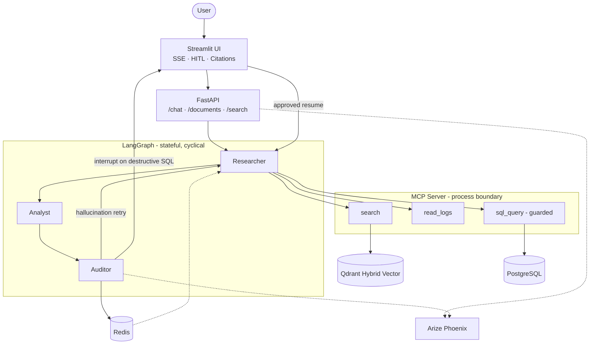

# Agentic RAG: Enterprise-Grade Agentic Knowledge Runtime

[](https://python.org)
[](https://fastapi.tiangolo.com)
[](https://langchain-ai.github.io/langgraph/)
[](https://qdrant.tech)
[](https://opentelemetry.io)
[](https://opensource.org/licenses/Apache-2.0)

> An autonomous knowledge system that connects enterprise documents, SQL databases, and logs through a secure MCP process boundary, it validates every LLM response against source material and requires human approval before any destructive database operation.


## Vision & Mission

Most RAG systems are wrappers. They fail in three ways that matter in production:

- **No verification.** If the model confabulates, the answer ships.
- **No security boundary.** Credentials live in agent code; every tool call is an injection vector.
- **No measurement.** "It seems to work" is not an engineering standard.

This project is designed against each failure mode: a cyclical Auditor loop that mathematically checks every response, an MCP process boundary that keeps credentials out of agent code, and a CI/CD faithfulness gate that blocks regressions before they reach production.

---

## Architecture & System Design

### System Topology



### Architecture Decisions

| # | Decision | Why |
|---|---|---|
| 1 | **MCP as internal process boundary** | Credentials cannot live in agent code. The process boundary enforces Principle of Least Privilege — a compromised agent cannot reach raw DB handles or `os.environ` on the data layer. A service layer in the same process doesn't provide this guarantee. |
| 2 | **Cyclical LangGraph over linear chains** | Recovery requires a graph. A linear chain ships a hallucinated answer. The `Auditor → Researcher` loop re-retrieves with an enriched query on every faithfulness failure; linear chains cannot express this control flow. |
| 3 | **HITL via `interrupt()` + Redis checkpoint** | Destructive SQL (`DELETE`, `UPDATE`) suspends the graph, surfaces a diff to the user, and resumes cleanly from the last checkpoint on approval. The agent never discards intermediate state regardless of the human decision. |
| 4 | **Hybrid search + cross-encoder reranking** | Dense-only misses exact terms; BM25-only misses paraphrase. RRF fuses both into a Top-20 candidate set; a BGE cross-encoder then scores each query-chunk pair directly, not just embedding similarity, for Top-5. |
| 5 | **CI/CD faithfulness gate** | Quality regressions should fail the build, not reach production. A Ragas faithfulness score < 0.85 on any PR blocks merge to `main` — the same guarantee a failing unit test provides for code correctness. |

---

## Tech Stack & Services

### Services (Docker Compose)

| Service | Image | Role |
|---|---|---|
| `api` | `infra/api/Dockerfile` | FastAPI — routers, middleware, SSE streaming |
| `frontend` | `infra/frontend/Dockerfile` | Streamlit — trace viewer, HITL approval, citations |
| `qdrant` | `qdrant/qdrant` | Hybrid vector DB (dense + sparse) |
| `postgres` | `postgres:16` | Structured operational data |
| `redis` | `redis:7-alpine` | LangGraph state checkpointer |
| `phoenix` | `infra/phoenix/docker-compose.yml` | OTEL trace collector + dashboard |

> **MCP Server** runs as a stdio subprocess (launched by the agent process), not a separate Docker service.

### Source Layout

```text
src/
├── api/          routers/       — thin HTTP entrypoint, no business logic
├── rag/          chunking · embeddings · ingest · retriever · reranker
├── agents/       graph · state · nodes (researcher/analyst/auditor) · checkpointer
├── mcp_server/   server · tools/ (rag_search · read_logs)
├── evals/        datasets/ · ragas_runner.py
├── adapters/     vector_store/qdrant.py
├── observability/ logging · tracing
├── schemas/      Pydantic DTOs
└── core/         config · exceptions
```

Dependency direction (enforced): `api / mcp → agents → rag → adapters → core`

### Technology Choices

| Layer | Technology | Rationale |
|---|---|---|
| API | FastAPI | Async-native, SSE support, OTEL hooks |
| Orchestration | LangGraph | Cyclical graphs, `interrupt()` for HITL, Redis checkpointer built-in |
| Vector DB | Qdrant | Native hybrid search (dense + sparse); payload filtering for multi-tenancy |
| Embeddings | FastEmbed | Fully local, no external API dependency |
| Reranking | BGE-Reranker | Cross-encoder pair scoring; runs entirely offline |
| MCP | `mcp[cli]` / FastMCP | Process-boundary isolation; stdio transport |
| State | Redis | First-class LangGraph checkpointer backend |
| Tracing | Arize Phoenix + OTEL | LLM-native spans; OpenInference semantic conventions |
| Evaluation | Ragas / DeepEval | Faithfulness scoring; direct CI integration |
| Packaging | `uv` | Deterministic lockfile, fast resolution |

---

## Engineering Goals

**"How does the agent access data without holding credentials?"**
The MCP process owns all connection handles. Agent-layer compromise does not imply data-layer compromise.

**"How do you know the model isn't hallucinating?"**
The Auditor runs an entailment check on every response. Failure triggers a retry — not a user-facing answer.

**"What if the model tries to delete production data?"**
The graph suspends. The user sees the exact proposed SQL. Nothing runs without explicit approval.

**"How do you prevent a prompt change from silently degrading quality?"**
Ragas faithfulness < 0.85 on any PR fails the GitHub Actions check and blocks the merge.

**"What if the agent crashes mid-conversation?"**
LangGraph checkpoints to Redis after each node. The next request resumes from the last committed state.

---

## Current Status

| Step | Scope | Status |
|---|---|---|
| **1** | Advanced RAG — heading-aware chunking, hybrid search, cross-encoder reranking | ✅ Done |
| **2** | MCP Server — search tool, log reader, guarded SQL tool | 🔄 In Progress |
| **3** | Multi-Agent — LangGraph Researcher · Analyst · Auditor + Redis checkpoint | ⬜ Planned |
| **4** | UI/UX — SSE trace stream, citations, HITL approval | ⬜ Planned |
| **5** | CI/CD Evals — Ragas faithfulness gate on GitHub Actions | ⬜ Planned |

**Foundation complete:** multi-stage Docker, modular docker-compose, OpenTelemetry → Arize Phoenix tracing, structured JSON logging with request-ID correlation, centralized exception handling, Qdrant with dense + sparse collection configuration.

---

## Getting Started

**Prerequisites:** Docker Desktop, `uv`

```bash
# 1. Clone and configure environment
git clone https://github.com/Melce-AI/agentic-rag.git
cd agentic-rag
cp .env.example .env          # fill in OPENAI_API_KEY and review other defaults
```

```bash
# 2. Create the external Qdrant volume (first time only)
docker volume create qdrant_data
```

```bash
# 3. Start all services (API · Frontend · Qdrant · Phoenix)
docker compose up --build
```

| Service | URL |
|---|---|
| API + OpenAPI docs | http://localhost:8089/docs |
| Streamlit UI | http://localhost:8501 |
| Arize Phoenix (traces) | http://localhost:6006 |
| Qdrant dashboard | http://localhost:6333/dashboard |

```bash
# Run tests
uv sync && uv run pytest

# MCP Inspector — inspect tools interactively (development)
uv run mcp dev src/mcp_server/server.py
```

---

## License

Apache 2.0